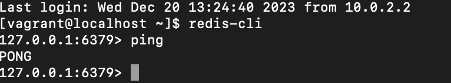

# Devops Project

## Installations

1. Clone repository
   
```sh
git clone https://github.com/inchirahjabir/ece-devops-Dimitriu-Jabir.git
```

2. Install [Vagrant](https://www.vagrantup.com/downloads.html)

3. Install [Docker](https://www.docker.com/get-started)
   
4. Install [Minikube](https://minikube.sigs.k8s.io/docs/start/)

## 1. Create a web application

The web application is located in the userapi folder. It is based on the draft application from Lab 3 and includes additional CRUD functionnalities such as update and delete. The application uses a Redis database and is rigorously tested with unit tests, API tests, configuration tests, and connection tests.

1. Install Dependencies:
```sh
npm install
```

2. Run tests: 
```sh
npm test
```
Out of the 20 test that we run, the USERAPI create user test keeps failing: 


3. Start the application:
```sh
npm start
```


## 2. Apply CI/CD pipeline

For the CI/CD pipeline configuration, we opted for a combination of GitHub Actions for Continuous Integration (CI) and Microsoft Azure for Continuous Deployment (CD). GitHub Actions will automate the CI process, triggering builds on each push to the repository. Azure will handle the CD phase, automatically deploying the application to an Azure App Service upon successful completion of CI. The application will be accessed through the Azure App link : https://dimjab.azurewebsites.net. 


## 3. Configure and provision a virtual environment and run your application using the IaC approach

Regarding the Infrastructure as Code (IaC) approach, we used Vagrant to configure a virtual environment with a virtual machine running on a Linux distribution. The VM will be provisioned using Ansible, automating the installation of essential components such as the language runtime, database, and the application.  To do so, we utilized synchronized folders to streamline the deployment process and facilitate code updates. We also incorporated a health check mechanism for the application to ensure its continuous functionality. 

1. Initilize and provision the VM. It automaticaaly installs all the essential components and runs the healthchecks:
```sh
vagrant up
```


For example, we can see that Redis was successfully installed:



2. Check if the userapi folder was copied to the home/app directory:
```sh
vagrant ssh
```
```sh
ls /home/app
```


## 4. Build Docker image of your application

We containerized the application by building a Docker image, encapsulating all dependencies. We then pushed this image to Docker Hub for easy sharing and deployment.

1. Build the image: 
```sh
docker build -t devops-project .
```


2. Push the image to Docker Hub: 


## 5. Make container orchestration using Docker Compose

We orchestrated the containerized application using Docker Compose by creating a docker-compose.yml file. This file defines the services, networks, and configurations needed to start and run the application which simplifies the deployment.

1. Build and start services: 
```sh
docker-compose up
```

2. Check the running services
```sh
docker-compose ps
```


The application is now running and has exposed port 6500 on the host machine. As a result, it is accessible at http://localhost:6500 in our web browser.


## 6. Make docker orchestration using Kubernetes

We installed Minikube to create a local Kubernetes cluster, and then defined and applied Kubernetes manifest YAML files for deploying an application, configuring services, and setting up persistent volumes.

1. After writing the manifests, we apply them to Kubernetes:
```sh
kubectl apply -f .
```


2. Open a web service to access the application. The application is accessible via http://127.0.0.1:56829, which means that the service is successfully running within our Minikube cluster.
```sh
minikube service web
```


## 7. Make a service mesh using Istio

1. Install [Istio](https://istio.io/docs/setup/getting-started/)

2. Add a namespace label to instruct Istio to automatically inject sidecar proxies when we deploy our application later:
```sh
kubectl label namespace default istio-injection=enabled
```


3. Deploy application. All pods should report READY 2/2 and STATUS Running:


4. Apply the Istio manifests to manage routes and traffic: 


## 8. Implement Monitoring to your containerized application

1. Install Prometheus:
```sh
kubectl apply -f https://raw.githubusercontent.com/istio/istio/release-1.20/samples/addons/prometheus.yaml
```

2. Access the Prometheus UI:
```sh
kubectl port-forward -n istio-system svc/prometheus 9090:9090
```


We weren't able to access the Prometheus UI because the connection kept failing. 

3. Install Grafana: 
```sh
kubectl apply -f https://raw.githubusercontent.com/istio/istio/release-1.20/samples/addons/grafana.yaml
```

4.Access the Grafana UI:
```sh
kubectl port-forward -n istio-system svc/grafana 3000:3000
```

We weren't able to access the Grafana UI as well. 


## Authors

- Inchirah Jabir
- Nicolas Dimitriu
